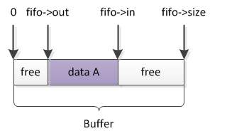

# 内核数据结构之FIFO

Kfifo是内核里面的一个first in first out数据结构，它采用环形循环队列（ringbuffer）的数据结构来实现；它提供一个无边界的字节流服务，最重要的一点是，它使用并行无锁编程技术，即当它用于只有一个入队线程和一个出队线程的场景时，两个线程可以并发操作，而不需要任何加锁行为，就可以保证kfifo的线程安全。

```c
struct kfifo {
    unsigned char * buffer;    /*the buffer holding the data*/
    unsigned int size;    /*the size of the allocated buffer*/
    unsigned int in;      /*data is added at offset (in % size)*/
    unsigned int out;     /*data is extracted from off. (out % size)*/
};
```



其中, `size`必须为2的幂次方

特点:
   * 初始状态: in == out == 0
   * 入队导致in递增, 出队导致out递增
   * 计算in对应的缓冲区索引的公式是fifo->in & (fifo->size-1) (`__kfifo_off()`)
   * 计算缓冲区中元素数量的公式是fifo->in – fifo->out(`kfifo_size()`)


## kfifo_init
根据给定buffer创建一个kfifo

## kfifo_alloc
给定size分配buffer和kfifo, kfifo->size的值总是在调用者传进来的size参数的基础上向2的幂扩展

## kfifo_free
释放kfifo空间

## kfifo_put
向kfifo中添加数据

## kfifo_get
从kfifo中取数据

## kfifo_len
获取kfifo中有数据的buffer大小

## kfifo_alloc
分配kfifo的buffer内核，并初始化kfifo。

## kfifo_in

## kfifo_out
