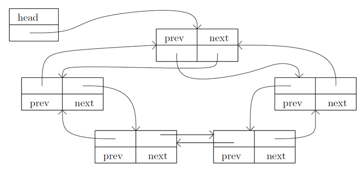

# 内核数据结构之链表

链表数据结构的定义(`include/linux/list.h`)
```c
struct list_head {
    struct list_head * next, * prev;
};
```
在 Linux 内核链表中, 不是在链表结构中包含数据, 而是 **在数据结构中包含链表节点** , 避免了为每个数据项类型定义自己的链表的麻烦.

## 链表接口

### 声明和初始化
Linux内核中只定义了链表节点, 并没有专门定义链表头, 那么一个链表结构是如何建立起来的呢？让我们来看看 LIST_HEAD() 这个宏：
```c
#define LIST_HEAD_INIT(name) { &(name), &(name) }
#define LIST_HEAD(name) struct list_head name = LIST_HEAD_INIT(name)
```
当用`LIST_HEAD(nf_sockopts)` 声明一个名为 `nf_sockopts` 的链表头时, 它的 `next`, `prev` 指针都初始化为指向其自己.
这样, 就产生一个空链表(Linux内核中用头指针的 next 是否指向自身来判断链表是否为空)
```c
static inline int list_empty(const struct list_head * head)
{
    return head->next == head;
}
```
除了用 `LIST_HEAD()` 宏在声明的时候初始化一个链表以外, `INIT_LIST_HEAD` 宏用于运行时初始化链表
```c
#define INIT_LIST_HEAD(ptr) do { \
        (ptr)->next = (ptr); (ptr)->prev = (ptr); \
} while (0)
```
使用时`INIT_LIST_HEAD(&nf_sockopts) `

### 插入
对链表的插入操作有两种
   * 在表头插入
```c
static inline void list_add(struct list_head * new, struct list_head * head);
```
   * 在表尾插入
```c
static inline void list_add_tail(struct list_head * new, struct list_head * head);
```

因为链表是循环表, 且表头的`next`, `prev` 分别指向链表中的第一个和最末一个节点, 所以 `list_add` 和 `list_add_tail` 的区别并不大.
实际上二者分别实现为
```c
__list_add(new, head, head->next);
__list_add(new, head->prev, head);
static inline void __list_add(struct list_head * new,
                              struct list_head * prev,
                              struct list_head * next)
{
      next->prev = new;
      new->next = next;
      new->prev = prev;
      prev->next = new;
}

```
可见: 在表头插入是插入在 head 之后, 而在表尾插入是插入在 head->prev 之后.

添加一个新 nf_sockopt_ops 结构变量 new_sockopt 到 nf_sockopts 链表头
```c
list_add(&new_sockopt.list, &nf_sockopts);
```
`nf_sockopts`链表中记录的并不是`new_sockopt`的地址, 而是其中的`list`元素的地址


可见, list建立好后将形如以下的结构:




### 移动
将原本属于一个链表的节点移动到另一个链表的操作，并根据插入到新链表的位置分为两类：
```c
static inline void list_move(struct list_head * list, struct list_head * head);
static inline void list_move_tail(struct list_head * list, struct list_head * head);
```
例如
```c
list_move(&new_sockopt.list, &nf_sockopts); /*把 new_sockopt 从它所在的链表上删除, 并将其再链入 nf_sockopts 的表头*/
```

### 合并
整个链表的插入
```c
static inline void list_splice(struct list_head * list, struct list_head * head);
```
假设当前有两个链表, 表头分别是 list1 和 list2, 当调用 `list_splice(&list1,&list2)` 时,
只要 list1 非空，list1 链表的内容将被挂接在 list2 链表上, 位于 list2 和 list2.next (原 list2 表的第一个节点) 之间/
新 list2 链表将以原 list1 表的第一个节点为首节点, 而尾节点不变.

当 list1 被挂接到 list2 之后, 为原表头指针的 list1 的 next、prev 仍然指向原来的节点.
为了避免引起混乱
```c
static inline void list_splice_init(struct list_head * list, struct list_head * head);
```
在将 list 合并到 head 链表的基础上, 调用 INIT_LIST_HEAD(list) 将 list 设置为空链

### 由链表节点得到数据项
`list_entry(ptr, type, member)`宏
   * ptr 是指向该数据中 list_head 成员的指针, 也就是存储在链表中的地址值
   * type 是数据项的类型
   * member 则是数据项类型定义中 list_head 成员的变量名
```c
#define list_entry(ptr, type, member) container_of(ptr, type, member)
/*include/linux/kernel.h*/
#define container_of(ptr, type, member) ({                   \
        const typeof( ((type * )0)->member ) * ____mptr = (ptr); \
        (type * )( (char * ) ____mptr - offsetof(type,member) );})
/*include/linux/stddef.h*/
#define offsetof(TYPE, MEMBER) ((size_t) &((TYPE * )0)->MEMBER)
```
**总结**: 先求得结构成员在该结构中的偏移量，然后根据成员变量的地址反过来得出属主结构变量的地址

### 遍历
```c
/*include/linux/list.h*/
#define list_for_each(pos, head) \
        for (pos = (head)->next, prefetch(pos->next); pos != (head); \
        pos = pos->next, prefetch(pos->next))
```
可以看出:`list_for_each`使用了辅助指针pos, pos是 **从第一节点开始的，并没有访问头节点**,
直到pos到达头节点指针head的时候结束。
示例
```c
struct list_head *i;
list_for_each(i, &nf_sockopts) {
    struct nf_sockopt_ops * ops = list_entry(i, struct nf_sockopt_ops, list);
}
```
```c
struct nf_sockopt_ops *ops;
list_for_each_entry(ops, &nf_sockopts, list) {
 /*code*/
}
```

### 其它遍历
某些应用需要反向遍历链表，Linux 提供了 list_for_each_prev() 和 list_for_each_entry_reverse() 来完成这一操作，使用方法和上面介绍的 list_for_each()、list_for_each_entry() 完全相同。

如果遍历不是从链表头开始，而是从已知的某个节点 pos 开始，则可以使用 list_for_each_entry_continue(pos, head, member)。有时还会出现这种需求，即经过一系列计算后，如果 pos 有值，则从 pos 开始遍历，如果没有，则从链表头开始，为此，Linux 专门提供了一个 list_prepare_entry(pos, head, member) 宏，将它的返回值作为 list_for_each_entry_continue() 的 pos 参数，就可以满足这一要求。

### 释放
```c
static inline void __list_del(struct list_head * prev, struct list_head * next)
{
     next->prev = prev;
     prev->next = next;
}

static inline void list_del(struct list_head * entry)
{
     __list_del(entry->prev, entry->next);
     entry->next = LIST_POISON1;
     entry->prev = LIST_POISON2;
}
#define list_for_each_safe(pos, n, head) \
    for (pos = (head)->next, n = pos->next; pos != (head); \
        pos = n, n = pos->next)

```
使用`list_for_each_safe`遍历并 list_del 节点后 **free**/**kfree**

# 示例代码
```c
```

编译命令:
`gcc -D__KERNEL__ -I./linux-headers-4.4.0-21/include/ kernellist.c`
**注意: __KERNEL__宏**


# 参考资料
   1. [深入分析Linux内核链表](https://www.ibm.com/developerworks/cn/linux/kernel/l-chain/)
   2. [FAQ/LinkedLists](http://kernelnewbies.org/FAQ/LinkedLists)
