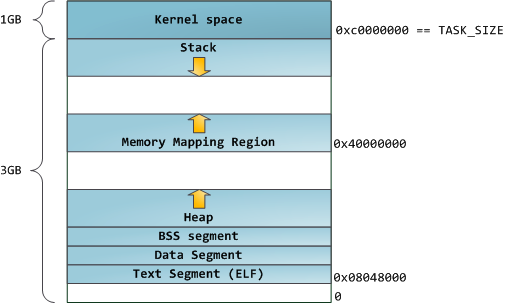
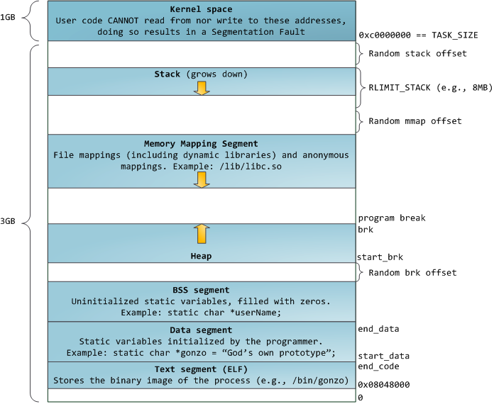
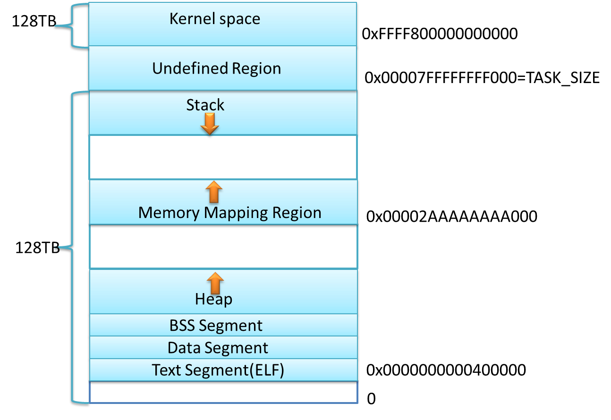

# Linux中内存相关命令与配置

## 内存布局





加入了几种Random offset随机偏移, 增加了内存溢出攻击的难度
堆向上, mmap向下增长





## 查看进程内存使用情况
   * `top -d 1 -p pid [,pid ...]`  //设置为delay 1s，默认是delay 3s   
如果想根据内存使用量进行排序，可以shift + m（Sort by memory usage）
   * pmap
   * ps
   * /proc/_pid_/status
      * cat /proc/_pid_/status | grep VmSize 任务虚拟地址空间的大小
      * cat /proc/_pid_/status | grep VmRSS  应用程序正在使用的物理内存的大小

## 关于free
`Memory=Used+Free+Buffer+Cache`   
free -m的结果可以用下面的公式表示  
```
Mem:               used=Used+Buffer+Cache / free=Free
-/+buffers/cache:  used=Used/free=Free+Buffer+Cache
```

## 清空cache:  
`sudo sysctl vm.drop_caches=3 `释放buffer+cache   
`echo 1 > /proc/sys/vm/drop_caches`   

## 内核空间的内存
`slabtop -s c | head`

`cat /proc/slabinfo |awk 'BEGIN{sum=0;}{sum=sum+$3*$4;}END{print sum/1024/1024}'`

`grep PageTables /proc/meminfo`


## 共享内存配置
   * /proc/sys/kernel/shmmax 参数定义共享内存段的最大尺寸
   * /proc/sys/kernel/shmmni 设置系统范围内共享内存段的最大数量
   * /proc/sys/kernel/shmall 系统一次可以使用的共享内存总量（以页为单位）
