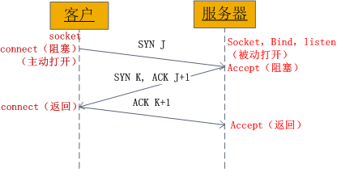

## 示意图



从图中可以看出: 当客户端调用`connect`时, 进行连接请求, 向服务器发送`SYN J`包, `connect`进入阻塞状态;  服务器收到`SYN J`包, 调用`accept`函数接收请求向客户端发送`SYN K`,`ACK J+1`, 这时`accept`进入阻塞状态; 客户端收到服务器的`SYN K`,`ACK J+1`之后, `connect`返回, 发送`ACK K+1`进行确认; 服务器收到`ACK K+1`, `accept`返回, 至此三次握手完毕,连接建立.


关闭时客户端首先调用`close`主动关闭连接, TCP发送一个`FIN M`, 处于`FIN_WAIT1`状态; 服务器接收到`FIN M`之后, 执行被动关闭, 对这个`FIN`进行确认, 返回给c客户端`ACK`; 客户端收到`ACK`后处于`FIN_WAIT2`状态, 服务器进入`CLOSE_WAIT`状态, 它的接收也作为文件结束符传递给应用进程, 因为`FIN`的接收意味着应用进程在相应的连接上再也接收不到额外数据, 因此当服务端`read`返回为0(即检测到客户端的关闭操作), 调用`close`关闭, 导致服务器端的TCP也发送一个`FIN N`, 状态进入`LAST_ACK` ; 当客户端收到来自服务端的`FIN`后, 进入`TIME_WAIT`状态, 并向服务器端发送一个`ACK`, 服务器端收到后, 进入`CLOSED`.
这样每个方向上都有一个FIN和ACK。

# TCP状态

## LISTENING

## SYN-SENT
客户端通过调用`connect`进行Active Open, 客户端tcp发送一个`SYN`以请求建立一个连接, 状态置为SYN_SENT.

## SYN-RECEIVED
当服务器收到客户端发送的SYN包后, 将标志位ACK和SYN置1发送给客户端, 此时服务器端处于SYN_RCVD状态

## ESTABLISHED
客户端收到服务器端发送的ACK包后, 发送ACK+1给服务器端, 此时双方处于ESTABLISHED状态

## FIN-WAIT-1
主动关闭(Active Close)端应用程序调用`close`, 其TCP发出`FIN`请求主动关闭连接, 进入`FIN_WAIT1`状态.

## CLOSE-WAIT
被动关闭(Passive Close)端TCP接到`FIN`后, 发出`ACK`以回应`FIN`请求(它的接收也作为文件结束符传递给上层应用程序), 并进入`CLOSE_WAIT`.

## FIN-WAIT-2
主动关闭端接到ACK后, 就进入了`FIN-WAIT-2`

**半关闭** 的状态: 在这个状态下, 应用程序还有接受数据的能力, 但是已经无法发送数据;
但是也有一种可能是, 客户端一直处于`FIN_WAIT_2`状态, 而服务器则一直处于`WAIT_CLOSE`状态, 而直到应用层来决定关闭这个状态.

## LAST-ACK
被动关闭端一段时间后, 接收到文件结束符的应用程序将调用`close`关闭连接. 这导致它的TCP也发送一个`FIN`, 等待对方的`ACK`, 进入了`LAST-ACK`

## TIME-WAIT
等待足够的时间以确保远程TCP接收到连接中断请求的确认

在主动关闭端接收到`FIN`后, TCP就发送`ACK`包, 并进入`TIME-WAIT`状态


## 客户端应用程序的状态迁移
```
CLOSED->SYN_SENT->ESTABLISHED->FIN_WAIT_1->FIN_WAIT_2->TIME_WAIT->CLOSED
```

## 服务器的状态迁移
```
CLOSED->LISTEN->SYN_RCVD->ESTABLISHED->CLOSE_WAIT->LAST_ACK->CLOSED
```

# SYN Flood 原理
进行三次握手时, 攻击软件向被攻击的服务器发送SYN连接请求, 但是其中地址是伪造的(例如随机伪造);
服务器在收到连接请求时将标志位ACK和SYN置1发送给客户端, 但是请求的IP地址是伪造的(IP存在会受到`RST`), 服务器不会收到握手第三步的`ACK`.
这种情况下服务器一般会重试(再次发送SYN+ACK)并等待一段时间后(SYN Timeout)丢弃这个未完成的连接. 一般来说SYM Timeout是分钟的量级.

如果恶意的攻击者大量模拟这种情况, 服务器端将为了维护一个非常大的半连接列表而消耗非常多的资源, 同时对这个列表中的IP进行SYN+ACK的重试.
这样正常的客户端得不到服务器的响应, 服务器端受到了SYN Flood攻击.

# 半连接队列长度
`listen`参数`backlog`在Linux 2.2之后表示的是已完成三次握手但还未被应用程序accept的队列长度; 半连接队列长度`tcp_max_syn_backlog`(man 7 tcp).
查看内核中`inet_csk_reqsk_queue_is_full()`.

`net.core.somaxconn`是`listen`参数`backlog`的上限(如果设置backlog大于net.core.somaxconn的话就会取net.core.somaxconn的值), 全连接队列长度.

# KeepAlive
以服务器端为例, 如果当前server端检测到超过一定时间没有数据传输, 那么会向client端发送一个`keep-alive`包(ACK和当前TCP序列号减一的组合),
此时client端应该为以下三种情况之一:
   1. client端仍然存在, 网络连接状况良好. 此时client端会返回一个`ACK`. server端接收到ACK后重置计时器.
   2. 客户端异常关闭, 或是网络断开. 在这两种情况下, client端都不会响应. 服务器没有收到响应, 会在一定时间后重复发送`keep-alive`, 并且重复发送一定次数.
   3. 客户端曾经崩溃, 但已经重启. 这种情况下, 服务器将会收到对其存活探测的响应, 但响应是一个`RESET`. 从而引起服务器对连接的终止

## Keepalive参数
```
net.ipv4.tcp_keepalive_intvl = 20
net.ipv4.tcp_keepalive_probes = 3
net.ipv4.tcp_keepalive_time = 60
```
代码中:
```c
#include <sys/socket.h>  
#include <netinet/in.h>  
#include <arpa/inet.h>  
#include <sys/types.h>  
#include <netinet/tcp.h>  

int keepAlive = 1; // 开启keepalive属性  
int keepIdle = 60; // 如该连接在60秒内没有任何数据往来,则进行探测   
int keepInterval = 5; // 探测时发包的时间间隔为5 秒  
int keepCount = 3; // 探测尝试的次数.如果第1次探测包就收到响应了,则后2次的不再发.  

setsockopt(rs, SOL_SOCKET, SO_KEEPALIVE, (void * )&keepAlive, sizeof(keepAlive));  
setsockopt(rs, SOL_TCP, TCP_KEEPIDLE, (void * )&keepIdle, sizeof(keepIdle));  
setsockopt(rs, SOL_TCP, TCP_KEEPINTVL, (void * )&keepInterval, sizeof(keepInterval));  
setsockopt(rs, SOL_TCP, TCP_KEEPCNT, (void * )&keepCount, sizeof(keepCount));   
```
在程序中表现为: 当tcp检测到对端socket不再可用时(不能发出探测包,或探测包没有收到ACK的响应包),select会返回socket可读,
并且在recv时返回-1,同时置上errno为ETIMEDOUT.
