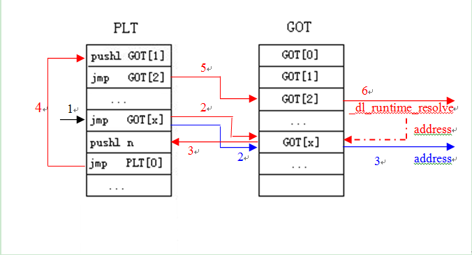

# 动态链接
链接器功能:
   * 符号解析
   * 重定位

## 动态库函数的加载过程

调用函数: 压入参数, 保存返回地址, 然后跳转到函数名指向的代码

## 示例程序
```c
#include <stdio.h>
int main()
{
    printf("Hello, world\n");
    return 0;
}
```

`gcc -m32 -g hello.c` 产生 a.out

`objdump -S a.out`反汇编

```c
0804840b <main>:
#include <stdio.h>
int main()
{
 804840b:	8d 4c 24 04          	lea    0x4(%esp),%ecx
 804840f:	83 e4 f0             	and    $0xfffffff0,%esp
 8048412:	ff 71 fc             	pushl  -0x4(%ecx)
 8048415:	55                   	push   %ebp
 8048416:	89 e5                	mov    %esp,%ebp
 8048418:	51                   	push   %ecx
 8048419:	83 ec 04             	sub    $0x4,%esp
    printf("Hello, world\n");
 804841c:	83 ec 0c             	sub    $0xc,%esp
 804841f:	68 c0 84 04 08       	push   $0x80484c0
 8048424:	e8 b7 fe ff ff       	call   80482e0 <puts@plt>
 8048429:	83 c4 10             	add    $0x10,%esp
    return 0;
 804842c:	b8 00 00 00 00       	mov    $0x0,%eax
}
 8048431:	8b 4d fc             	mov    -0x4(%ebp),%ecx
 8048434:	c9                   	leave  
 8048435:	8d 61 fc             	lea    -0x4(%ecx),%esp
 8048438:	c3                   	ret    
 8048439:	66 90                	xchg   %ax,%ax
 804843b:	66 90                	xchg   %ax,%ax
 804843d:	66 90                	xchg   %ax,%ax
 804843f:	90                   	nop
```
注意上面的`call   80482e0 <puts@plt>`, 查看其汇编代码
```
080482e0 <puts@plt>:
 80482e0:	ff 25 0c a0 04 08    	jmp    *0x804a00c
 80482e6:	68 00 00 00 00       	push   $0x0   ; puts 在GOT里的偏移,以便在函数定位完成后将函数的实际地址写到GOT这个位置
 80482eb:	e9 e0 ff ff ff       	jmp    80482d0 <_init+0x28>
```

## 使用GDB分析加载过程
`gdb ./a.out`

```
(gdb) b main
Breakpoint 1 at 0x804841c: file hello.c, line 4.
(gdb) r
(gdb) x 0x804a00c
0x804a00c:	0x080482e6
```
这正是 **puts@plt中的第二行汇编代码的地址**, 因此将继续执行到 `jmp    80482d0 <_init+0x28>`

观察`0x80482d0`处的指令
```
(gdb) x /10i 0x80482d0
   0x80482d0:	pushl  0x804a004
   0x80482d6:	jmp    *0x804a008
   0x80482dc:	add    %al,(%eax)
   0x80482de:	add    %al,(%eax)
   ...
(gdb) x /x 0x804a008
0x804a008:	0xf7fedf00
```
根据`ldd a.out`推断, 这是libc的一个函数. 根据资料, 推断为`_dl_runtime_resolve`

```
(gdb) x /20i 0xf7fedf00
   0xf7fedf00:	push   %eax
   0xf7fedf01:	push   %ecx
   0xf7fedf02:	push   %edx
   0xf7fedf03:	mov    0x10(%esp),%edx ; 0x804a004
   0xf7fedf07:	mov    0xc(%esp),%eax  ; 0x00
   0xf7fedf0b:	call   0xf7fe76e0   ; 这个函数中应该找到了puts函数的地址, 并将其放入EAX中(_dl_fixup)
   0xf7fedf10:	pop    %edx
   0xf7fedf11:	mov    (%esp),%ecx
   0xf7fedf14:	mov    %eax,(%esp) ; 作为_dl_runtime_resolve的返回地址, 即 ret后进入puts
   0xf7fedf17:	mov    0x4(%esp),%eax
   0xf7fedf1b:	ret    $0xc
```

综上可知`puts`的加载原理: 调用puts实际上是调用puts@plt, 其中第一条指令调用GOT中保存的地址, 在函数第一次调用之前,
其中的值是为调用`_dl_runtime_resolve`做准备的; 第一次调用,通过`_dl_runtime_resolve`解析到函数地址并保存GOT里,
然后执行. 之后再调用该函数, plt里第一条指令就能跳转到函数的地址.


# ELF文件的动态连接机制

   * **全局偏移表(Global Offset Table,GOT)**
在位置无关代码中(如共享库), 一般不能包含绝对虚拟地址. 当在程序中引用某个共享库中的符号时, 编译链接阶段并不知道这个符号的具体位置,
只有等到动态链接器将所需要的共享库加载时进内存后, 在运行阶段, 符号的地址才会最终确定.  
因此, 需要有一个数据结构来保存符号的绝对地址, 这就是GOT表的作用.
GOT表中每项保存程序中引用其它符号的绝对地址, 这样, 程序就可以通过引用GOT表来获得某个符号的地址.

在x86结构中, GOT表的前三项保留, 用于保存特殊的数据结构地址, 其它的各项保存符号的绝对地址.
对于符号的动态解析过程, 需要了解第二项和第三项(`GOT[1]`和`GOT[2]`): GOT[1]保存的是指向已经加载的共享库的链表地址(加载的共享库会形成一个链表);
GOT[2]保存的是一个函数的地址: `GOT[2] = &_dl_runtime_resolve`, 这个函数的主要作用就是找到某个符号的地址, 并 **把它写到与此符号相关的GOT项中**, 然后将控制转移到目标函数.

   * **过程连接表(Procedure Linkage Table,PLT)**
PLT的作用是将位置无关的函数调用转移到绝对地址. 在编译链接时, 链接器并不能控制执行从一个可执行文件或者共享文件中转移到另一个中(编译时函数的地址还不能确定),
因此, 链接器将控制转移到PLT中的某一项. 而PLT通过引用GOT表中的函数的绝对地址, 来把控制转移到实际的函数

在可执行程序或者共享目标文件中, GOT表在名称为.got.plt的section中, PLT表在名称为.plt的section中;

每一个外部定义的符号在GOT中有相应的条目,如果符号是函数则在PLT中也有相应的条目, 且一个PLT条目对应一个GOT条目
   1. 代码中调用外部函数func, 语句形式为`call 0xaabbccdd`, 0xaabbccdd实际上就是符号func在PLT表中对应的条目地址(假设地址为标号.PLT2)
   2. PLT表的形式如下
```
.PLT0: pushl   4(%ebx)           /* GOT表的地址保存在寄存器ebx中 */
jmp            *8(%ebx)
nop; nop
nop; nop
.PLT1: jmp            *name1@GOT(%ebx)
pushl          $offset
jmp            .PLT0@PC
.PLT2: jmp            *func@GOT(%ebx)
pushl          $offset
jmp            .PLT0@PC
```

   3. 查看标号.PLT2的语句, 实际上是跳转到符号func在GOT表中对应的条目
   4. 在符号重定位前, GOT表中此符号对应的地址下一条语句(`pushl $offset`, offset是符号func的重定位偏移量). 注意到这是一个二次跳转.
   5. 在`offset`入栈后, 跳到PLT表的第一条目(.PLT0), 把GOT[1]的内容(放置了用来标识特定库的代码)压栈，并跳转到GOT[2]对应的地址
   6. GOT[2]对应的实际上是动态符号解析函数的代码, 在对符号func的地址解析后, 会把func在内存中的地址设置到GOT表中func对应的条目中
   7. 当第二次调用func时, GOT表中对应的条目已经包含了其地址, 就可直接调用而不需要利用PLT表进行跳转




# 参考资料
   1. [程序的链接和装入及Linux下动态链接的实现](http://www.ibm.com/developerworks/cn/linux/l-dynlink/)
   2. [共享库函数调用原理](http://blog.csdn.net/absurd/article/details/3169860)
   3. [Linux GOT与PLT](http://www.programlife.net/linux-got-plt.html)
   4. [ELF文件的加载和动态链接过程](http://jzhihui.iteye.com/blog/1447570)
   5. []()
