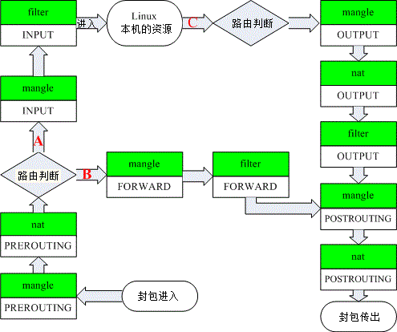

# 简介
Linux内建了`netfilter`机制. 数据包过滤, 即分析进入主机的网络数据包, 对数据包的头进行分析, 以决定放行或阻挡的机制. 可以通过`iptables`命令来设置`netfilter`的过滤机制.

   * netfilter是内核的一部分, 由一些信息包过滤表组成, 这些表包含内核用来控制信息包过滤处理的规则集.
   * iptables 组件是一种工具, 它使插入、修改和除去信息包过滤表中的规则变得容易.

防火墙的规则指定所检查包的特征和目标: 如果包不匹配, 将送往该链中下一条规则检查; 如果匹配, 那么下一条规则由目标值确定.
该目标值可以是用户定义的链名, 或是某个专用值, 如`ACCEPT`, `DROP`, `QUEUE`或者`RETURN`.


# iptables的`表`和`链`
## Filter(过滤器)
进入Linux本机的数据包有关, 是默认的表.
   * INPUT
   * OUTPUT
   * FORWARD

## NAT(地址转换)
与Linux本机无关, 主要与Linux主机后的局域网内计算机相关
   * PREROUTING
   * POSTROUTING
   * OUTPUT

## Mangle(破坏者)
这个表主要是与特殊的数据包的路由标志有关(通常不用涉及到这个表的修改)
   * PREROUTING
   * OUTPUT
   * INPUT
   * FORWARD



当一个数据包转给Netfilter后, Netfilter会按上面的流程依次比对每一张表, 如果数据包符合表中所述, 则进行相应的处理.

# iptables命令
```
iptables [-t table] -CMD chain CRETIRIA -j ACTION
```
其中:
   1. `-t table`: table为filter, nat, mangle之一, 如果没有指定, 默认是filter
   2. CMD: 操作命令, 查看、添加、替换、删除等
   3. chain: 链, 指定是对表中的哪条链进行操作, 如filter表中的INPUT链
   4. CRETIRIA: 匹配模式, 对要过滤的数据包进行描述
   5. ACTION: 操作, 接受,拒绝,丢弃等

# 查看
`iptables [-t table] -L [-nv]`

# 添加
`iptables [-t table] -A chain CRETIRIA -j ACTION`

将新规则加入到表table的chain链的最后位置

# 插入
`iptables [-t table] -I chain pos CRETIRIA -j ACTION`

将新规则插入到table表chain链的pos位置, 原来之后的规则都往后推一位.

# 替换
`iptables [-t table] -R chain pos CRETIRIA -j ACTION`

用新规则替换table表chain链的pos位置的规则.

# 删除
`iptables [-t table] -D chain pos`
删除table表chain链的pos位置的规则.

`iptables [-t table] -F`
清空


# 包匹配(CRETIRIA)

包匹配就是用于描述需要过滤的数据包包头特殊的字段。

## 指定网口
   * `-i` ：数据包所进入的网络接口, 例如 eth0、lo等，需与INPUT链配合
   * `-o` : 数据包所传出的网络接口,  需与OUTPUT链配合

## 指定协议
   * `-p` : tcp, udp, icmp或all

## 指定IP网络
   * `-s` : 来源网络, 可以是IP或网络
        IP： 192.168.0.100
        网络： 192.168.0.0/24 或 192.168.0.0/255.255.255.0 均可
        可以在前加 ! 表示取反
   * `-d` : 目标网格

## 指定端口
   * `--sport` : 指定来源端口, 可以是单个端口, 还可以是连续的端口, 如: `1024:65535`
   * `--dport` : 指定目标端口
   * **注意**  : 要指定了tcp或udp协议才会有效。

## 指定MAC地址
   * `-m mac --mac-source aa:bb:cc:dd:ee:ff`

## 指定状态
   * `-m state --state STATUS`
   * STATUS可以是：
      * INVALID, 无效包
      * ESTABLISHED, 已经连接成功的连接状态
      * NEW, 想要新立连接的数据包
      * RELATED, 这个数据包与主机发送出去的数据包有关

## ICMP数据比对
如果不想被ping到, 就可以拒绝ICMP数据包
   * --icmp-type TYPE
   * TYPE如下
      * 8    echo-request(请求)
      * 0    echo-reply(响应)
      * **注意** : 需要与 `-p icmp` 配合使用

## 操作(ACTION)
   * DROP, 丢弃
   * ACCEPT, 接受
   * REJECT, 拒绝
   * LOG, 跟踪记录, 将访问记录写入 /var/log/messages

## 保存配置
将新设置的规则保存到文件
`iptables-save [-t table]` 将当前的配置保存到 `/etc/sysconfig/iptables`

## 其它
`iptables [-t table] [-FXZ]`
   * -F : 请除所有的已制订的规则
   * -X : 除掉所有用户"自定义""的chain
   * -Z : 将所有的统计值清0

# 示例
   1. 拒绝进入防火墙的所有ICMP协议数据包
```bash   
iptables -A INPUT -p icmp -j REJECT
```
   2. 允许防火墙转发除ICMP协议以外的所有数据包
```bash
iptables -A FORWARD -p ! icmp -j ACCEPT
```

   3. 拒绝转发来自192.168.0.10主机的数据, 允许转发来自192.168.0.0/24网段的数据
```bash
iptables -A FORWARD -s 192.168.0.11 -j REJECT
iptables -A FORWARD -s 192.168.0.0/24 -j ACCEPT
```
**说明**: 必须先REJECT, 因为如果先ACCEPT就默认不会检测下面的规则

   4. 丢弃从外网接口eth1进入防火墙本机的源地址为私网地址的数据包
```bash
iptables -A INPUT -i eth1 -s 192.168.0.0/16 -j DROP
iptables -A INPUT -i eth1 -s 172.16.0.0/12 -j DROP
iptables -A INPUT -i eth1 -s 10.0.0.0/8 -j DROP
```

   5. 封堵网段192.168.0.0/24, 两小时后解封
```bash
iptables -A INPUT -s 192.168.0.0/24 -j DROP       #从192.168.0.0网段进来的数据全部拒绝
iptables -A FORWARD -s 192.168.0.0/24 -j DROP     #从192.168.0.0远端来的禁止转发
at now +2 hours
at> iptables -D INPUT 1
at> iptables -D FORWARD 1
```

   6. 限制使用SSH远程登录防火墙主机
```bash
iptables -A INPUT -p tcp --dport 22 -s 192.168.0.2  -j ACCEPT    #  192.168.0.2主机允许访问22
iptables -A INPUT -p tcp --dport 22 -j DROP                      # 其他访问ssh(22)断开
```

   7. 允许本机开放从TCP端口20-1024提供的应用服务
```bash
iptables -A INPUT -p tcp --dport 20:1024 -j ACCEPT
iptables -A OUTPUT -p tcp --sport 20:1024 -j ACCEPT
```

   8. 允许转发来自192.168.0.0/24局域网段的DNS解析请求数据包
```bash
iptables -A FORWARD -s 192.168.0.0/24 -p udp --dport 53 -j ACCEPT
iptables -A FORWARD -d 192.168.0.0/24 -p udp --sport 53 -j ACCEPT
```

   9. 禁止转发来自MAC地址为00：0C：29：27：55：3F的和主机的数据包
```bash
iptables -A FORWARD -m mac --mac-source 00:0c:29:27:55:3F -j DROP
```

   10. 允许防火墙本机对外开放TCP端口20、21、25、110以及被动模式FTP端口1250-1280
```bash
iptables -A INPUT -p tcp -m multiport --dport 20,21,25,110,1250:1280 -j ACCEPT
```
**说明** : `-m multiport –dport`来指定目的多个端口

   11. 禁止转发源IP地址为192.168.1.20-192.168.1.99的TCP数据包
```bash
iptables -A FORWARD -p tcp -m iprange --src-range 192.168.1.20-192.168.1.99 -j DROP
```
**说明** : `-m –iprange –src-range`指定IP范围

   12. 拒绝访问防火墙的新数据包, 但允许响应连接或与已有连接相关的数据包
```bash
iptables -A INPUT -p tcp -m state --state NEW -j DROP
iptables -A INPUT -p tcp -m state --state ESTABLISHED,RELATED -j ACCEPT
```
**说明**: `ESTABLISHED`表示已经响应请求或者已经建立连接的数据包; `RELATED`表示与已建立的连接有相关性的, 比如FTP数据连接等

  13. 只开放本机的web服务, FTP(20,21,20450-20480), 放行外部主机发住服务器其它端口的应答数据包,将其他入站数据包均予以丢弃处理
```bash
iptables -I INPUT -p tcp -m multiport --dport 20,21,80 -j ACCEPT
iptables -I INPUT -p tcp --dport 20450:20480 -j ACCEPT
iptables -I INPUT -p tcp -m state --state ESTABLISHED -j ACCEPT
iptables -P INPUT DROP
```

   14. 来自192.168.0.0网段的客户, 通过eth0进来链接ssh的用户拒绝
```bash
iptables -A INPUT -i eth0 -p tcp -s 192.168.0.0/24 --sport 1024:65535 --dport ssh -j DROP
```
