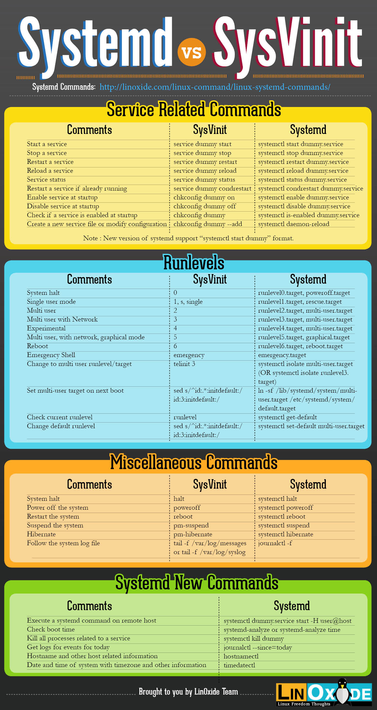

# systemd v.s init
OpenSUSE 42.1 用`systemd`替代了`init`, 成为`pid==1`的进程。  
为保证兼容性，系统中还存在`/etc/init.d`、`/sbin/init`；需要说明的是`/sbin/init`为`/usr/lib/systemd/systemd`的一个符号链接。
与`/etc/init.d`相对应，`/etc/systemd`的目录下是各个服务的配置文件。

## 对应关系
传统的init启动模式里面，有 RunLevel 的概念，跟 Target 的作用很类似

| SysV 启动级别	 | Systemd target | 说明 |
| ------------- | ---------------| ------ |
| 0            | runlevel0.target, poweroff.target | 中断系统（halt） |
|1, s, single	  | runlevel1.target, rescue.target | 单用户模式 |
|2, 4          | runlevel2.target, runlevel4.target, multi-user.target | 用户自定义启动级别，通常识别为级别3 |
|3            | runlevel3.target, multi-user.target | 多用户，无图形界面。用户可以通过终端或网络登录  |
|5            | runlevel5.target, graphical.target | 多用户，图形界面。继承级别3的服务，并启动图形界面服务 |
|6            | runlevel6.target, reboot.target | 重启 |
|emergency    | emergency.target | 急救模式（Emergency shell） |

## 主要区别
   * 1). runLevel在/etc/inittab中定义; systemd中为默认Target`/etc/systemd/system/default.target`
   * 2). init启动脚本位于/etc/init.d, 链接到不同的 RunLevel 目录(/etc/rc3.d、/etc/rc5.d等); systemd中位于`/lib/systemd/system`和`/etc/systemd/system`
   * 3). init进程的配置文件是/etc/inittab，各种服务的配置文件存放在/etc/sysconfig目录; systemd配置文件主要存放在/lib/systemd目录,在/etc/systemd目录里面的修改可以覆盖原始设置
   * 4) RunLevel 是互斥的，不可能多个 RunLevel 同时启动，但是多个 Target 可以同时启动。

## CheatSheet (from [linoxide](http://linoxide.com/linux-command/systemd-vs-sysvinit-cheatsheet/))


## systemd架构图


# systemd命令
`systemd`提供了一组命令，涉及到系统管理的各个方面。

## systemd-analyze命令
```
systemd-analyze [OPTIONS...] {COMMAND} ...
Profile systemd, show unit dependencies, check unit files.
Commands:
  time                    Print time spent in the kernel
  blame                   Print list of running units ordered by time to init
  critical-chain          Print a tree of the time critical chain of units
  plot                    Output SVG graphic showing service initialization
  dot                     Output dependency graph in dot(1) format
  set-log-level LEVEL     Set logging threshold for manager
  set-log-target TARGET   Set logging target for manager
  dump                    Output state serialization of service manager
  verify FILE...          Check unit files for correctness
```

## journalctl命令
Systemd 统一管理所有 Unit 的启动日志。带来的好处就是，可以只用`journalctl`一个命令，查看所有日志（内核日志和应用日志）。
日志的配置文件是`/etc/systemd/journald.conf`

### 查看所有日志（默认情况下 ，只保存本次启动的日志）
`sudo journalctl`

### 查看内核日志（不显示应用日志）
`sudo journalctl -k`

### 查看系统本次启动的日志
   1. `sudo journalctl -b`
   2. `sudo journalctl -b -0`

### 查看上一次启动的日志（需更改设置）
`sudo journalctl -b -1`

### 查看指定时间的日志
   1. `sudo journalctl --since="2012-10-30 18:17:16"`
   2. `sudo journalctl --since "20 min ago"`
   3. `sudo journalctl --since yesterday`
   4. `sudo journalctl --since "2015-01-10" --until "2015-01-11 03:00"`
   5. `sudo journalctl --since 09:00 --until "1 hour ago"`

### 显示尾部的最新10行日志
`sudo journalctl -n`

### 显示尾部指定行数的日志
`sudo journalctl -n 20`

### 实时滚动显示最新日志
`sudo journalctl -f`

### 查看指定服务的日志
`sudo journalctl /usr/lib/systemd/systemd`

### 查看指定进程的日志
`sudo journalctl _PID=1`

### 查看某个路径的脚本的日志
`sudo journalctl /usr/bin/bash`

### 查看指定用户的日志
`sudo journalctl _UID=33 --since today`

### 查看某个 Unit 的日志
   1. `sudo journalctl -u nginx.service`
   2. `sudo journalctl -u nginx.service --since today`

### 根据syslog的优先级获取日志
`sudo journalctl -p err`

### cgroup相关
   1. 获取服务之前的cgroup关系 `systemd-cgls`
   2. 获得运行中服务cgroup的资源统计 `systemd-cgtop`
   3. 获得某个服务的CPU.Shares `systemctl show -p CPUShares httpd.service`
   4. 配置某个服务的CPU.Shares `systemctl set-property httpd.service CPUShares=512`

### 服务管理
   1. `systemctl enable ntpd`
   2. `systemctl disable ntpd`
   3. `systemctl start ntpd`
   4. `systemctl stop ntpd`
   5. `systemctl restart ntpd`
   6. `systemctl reload ntpd`
   7. `systemctl is-enabled ntpd`
   8. `systemctl is-active ntpd`
   9. `systemctl status ntpd`

### 系统启动
   1. `sudo systemctl reboot`
   2. `sudo systemctl poweroff`
   3. `sudo systemctl halt` #CPU停止工作
   4. `sudo systemctl suspend`
   5. `sudo systemctl hibernate`
   6. `sudo systemctl hybrid-sleep` #交互式休眠
   7. `sudo systemctl rescue`

**关于reboot**
`/sbin/reboot`是到`/bin/systemctl`的符号链接。 systemctl中有关于`argv[0]`的判断, 如果是reboot的话则重启。对于shutdown等同理。

### hostnamectl
查看或设置当前主机的信息。

### localectl
查看或设置本地化设置。

### timedatectl
查看或设置时间日期项。

### loginctl
Send control commands to or query the login manager

## Unit
Systemd将资源统称为`Unit`。
Unit 一共分成12种。
   1. Service unit：系统服务
   2. Target unit：多个 Unit 构成的一个组
   3. Device Unit：硬件设备
   4. Mount Unit：文件系统的挂载点
   5. Automount Unit：自动挂载点
   6. Path Unit：文件或路径
   7. Scope Unit：不是由 Systemd 启动的外部进程
   8. Slice Unit：进程组
   9. Snapshot Unit：Systemd 快照，可以切回某个快照
   10. Socket Unit：进程间通信的 socket
   11. Swap Unit：swap 文件
   12. Timer Unit：定时器

`systemctl list-units`命令可以查看当前系统的所有 Unit
   1. `systemctl list-units`
   2. `systemctl list-units --all`
   3. `systemctl list-units --all --state=inactive`
   4. `systemctl list-units --failed`
   5. `systemctl list-units --type=service`

### Unit状态
`systemctl status`命令用于查看系统状态和单个 Unit 的状态
   1. `systemctl status`
   2. `systemctl status nigix.service`
   3. `systemctl is-active application.service`
   4. `systemctl is-failed application.service`
   5. `systemctl is-enabled application.service`

### Unit管理
   1. 立即启动一个服务 `sudo systemctl start apache.service`
   2. 立即停止一个服务 `sudo systemctl stop apache.service`
   3. 重启一个服务 `sudo systemctl restart apache.service`
   4. 杀死一个服务的所有子进程 `sudo systemctl kill apache.service`
   5. 重新加载一个服务的配置文件 `sudo systemctl reload apache.service`
   6. 重载所有修改过的配置文件 `sudo systemctl daemon-reload`
   7. 显示某个 Unit 的所有底层参数 `systemctl show httpd.service`

### Unit 依赖关系
Unit之间可以存在依赖关系。
   * `systemctl list-dependencies nginx.service`
   * `systemctl list-dependencies --all nginx.service` Target会展开

## Unit 的配置文件

每一个 Unit 都有一个配置文件，告诉 Systemd 怎么启动这个 Unit. 配置文件位于`/etc/systemd/system/`, 多是符号链接(到`/lib/systemd/system`中的文件)。
`sudo systemctl enable nginx`相当于
`sudo ln -s /lib/systemd/system/nginx.service /etc/systemd/system/multi-user.target.wants/nginx.service`

### 文件状态
`systemctl list-unit-files`命令用于列出所有配置文件。
`systemctl list-unit-files --type=service`列出指定类型的配置文件

这个列表显示每个配置文件的状态STATE，一共有四种。
`enabled`：已建立启动链接
`disabled`：没建立启动链接
`static`：该配置文件没有[Install]部分（无法执行），只能作为其他配置文件的依赖
`masked`：该配置文件被禁止建立启动链接

从配置文件的状态无法看出Unit是否正在运行. 使用`systemctl status`

一旦修改配置文件，就要让 SystemD 重新加载配置文件，然后重新启动，否则修改不会生效。
`sudo systemctl daemon-reload`
`sudo systemctl restart nginx.service`

###  配置文件的格式
`systemctl cat` 命令可以用来查看配置文件，例如 `systemctl cat ssh`显示ssh.service（默认）
```
# /lib/systemd/system/ssh.service
[Unit]
Description=OpenBSD Secure Shell server
After=network.target auditd.service
ConditionPathExists=!/etc/ssh/sshd_not_to_be_run

[Service]
EnvironmentFile=-/etc/default/ssh
ExecStart=/usr/sbin/sshd -D $SSHD_OPTS
ExecReload=/bin/kill -HUP $MAINPID
KillMode=process
Restart=on-failure
RestartPreventExitStatus=255
Type=notify

[Install]
WantedBy=multi-user.target
Alias=sshd.service
```
配置文件分成几个区块，每个区块的第一行，是用方括号表示的区别名，比如[Unit]。注意，配置文件的区块名和字段名，都是大小写敏感的。
每个区块包含若干条键值对。
**键值对的等号两侧不能有空格**

   1. `[Unit]`：启动顺序与依赖关系

用来定义 Unit 的元数据，以及配置与其他 Unit 的关系。它的主要字段:
   * Description：简短描述
   * Documentation：文档地址
   * Requires：当前 Unit 依赖的其他 Unit，如果它们没有运行，当前 Unit 会启动失败
   * Wants：与当前 Unit 配合的其他 Unit，如果它们没有运行，当前 Unit 不会启动失败
   * BindsTo：与Requires类似，它指定的 Unit 如果退出，会导致当前 Unit 停止运行
   * Before：如果该字段指定的 Unit 也要启动，那么必须在当前 Unit 之后启动
   * After：如果该字段指定的 Unit 也要启动，那么必须在当前 Unit 之前启动
   * Conflicts：这里指定的 Unit 不能与当前 Unit 同时运行
   * Condition...：当前 Unit 运行必须满足的条件，否则不会运行
   * Assert...：当前 Unit 运行必须满足的条件，否则会报启动失败

   2. `[Service]` 定义如何启动当前服务

用来 Service 的配置，只有 Service 类型的 Unit 才有这个区块。它的主要字段:

   Type：定义启动时的进程行为。它有以下几种值。
     Type=simple：默认值，执行ExecStart指定的命令，启动主进程
     Type=forking：ExecStart字段将以fork()方式启动，此时父进程将会退出，子进程将成为主进程
     Type=oneshot：类似于simple，但只执行一次，Systemd 会等它执行完，才启动其他服务
     Type=dbus：当前服务通过D-Bus启动
     Type=notify：类似于simple，启动结束后会发出通知信号，然后 Systemd 再启动其他服务
     Type=idle：若有其他任务执行完毕，当前服务才会运行
   ExecStart：启动当前服务的命令
   ExecStartPre：启动当前服务之前执行的命令
   ExecStartPost：启动当前服务之后执行的命令
   ExecReload：重启当前服务时执行的命令
   ExecStop：停止当前服务时执行的命令
   ExecStopPost：停止当其服务之后执行的命令
   所有的启动设置之前，都可以加上一个连词号`-`，表示"抑制错误"，即发生错误的时候，不影响其他命令的执行。
   RestartSec：自动重启当前服务间隔的秒数
   Restart：定义何种情况 Systemd 会自动重启当前服务，可能的值包括always（总是重启）、on-success、on-failure、on-abnormal、on-abort、on-watchdog
   TimeoutSec：定义 Systemd 停止当前服务之前等待的秒数
   Environment：指定环境变量
   `EnvironmentFile`：指定当前服务的环境参数文件。该文件内部的key=value键值对，可以用$key的形式，在当前配置文件中获取。
   `KillMode`：定义 Systemd 如何停止 sshd 服务。KillMode字段可以设置的值如下。
    `control-group`（默认值）：当前控制组里面的所有子进程，都会被杀掉
    `process`：只杀主进程
    `mixed`：主进程将收到 SIGTERM 信号，子进程收到 SIGKILL 信号
    `none`：没有进程会被杀掉，只是执行服务的 stop 命令。
`Restart`：定义了退出后，Systemd的重启方式。
上面的例子中，Restart设为on-failure，表示任何意外的失败，就将重启sshd。如果 sshd 正常停止（比如执行systemctl stop命令），它就不会重启。
Restart字段可以设置的值如下。
    `no`（默认值）：退出后不会重启
    `on-success`：只有正常退出时（退出状态码为0），才会重启
    `on-failure`：非正常退出时（退出状态码非0），包括被信号终止和超时，才会重启
    `on-abnormal`：只有被信号终止和超时，才会重启
    `on-abort`：只有在收到没有捕捉到的信号终止时，才会重启
    `on-watchdog`：超时退出，才会重启
    `always`：不管是什么退出原因，总是重启
    对于守护进程，推荐设为on-failure。对于那些允许发生错误退出的服务，可以设为on-abnormal。


   3. `[Install]` 定义如何安装这个配置文件，即怎样做到开机启动。

定义如何启动，以及是否开机启动。它的主要字段:

   `WantedBy`：一个或多个 Target，`systemctl enable `时,其符号链接会放入/etc/systemd/system/_Target名.wants_
   `RequiredBy`：一个或多个 Target，`systemctl enable `时，符号链接会放入/etc/systemd/system/_Target名.required_
   `Alias`：当前 Unit 可用于启动的别名
   `Also`：当前 Unit`enable` 时，会被同时`enable`的Unit

## Target
Target 是一组Unit。启动某个 Target 的时候Systemd 就会启动里面所有的 Unit.

### 查看当前系统的所有 Target
`systemctl list-unit-files --type=target`
### 查看一个 Target 包含的所有 Unit
`systemctl list-dependencies multi-user.target`
### 查看启动时的默认 Target
`systemctl get-default`
### 设置启动时的默认 Target
`sudo systemctl set-default multi-user.target`
### 切换 Target 时，默认不关闭前一个 Target 启动的进程，
### 关闭前一个 Target 里面所有不属于后一个 Target 的进程
`sudo systemctl isolate multi-user.target`

### Target 的配置文件
`systemctl cat multi-user.target`

```
# /lib/systemd/system/multi-user.target
#  This file is part of systemd.
#
#  systemd is free software; you can redistribute it and/or modify it
#  under the terms of the GNU Lesser General Public License as published by
#  the Free Software Foundation; either version 2.1 of the License, or
#  (at your option) any later version.

[Unit]
Description=Multi-User System
Documentation=man:systemd.special(7)
Requires=basic.target
Conflicts=rescue.service rescue.target
After=basic.target rescue.service rescue.target
AllowIsolate=yes
```

`Requires`字段：要求basic.target一起运行。
`Conflicts`字段：冲突字段。如果rescue.service或rescue.target正在运行，multi-user.target就不能运行，反之亦然。
`After`：表示multi-user.target在basic.target 、 rescue.service、 rescue.target之后启动，如果它们有启动的话。
`AllowIsolate`：允许使用systemctl isolate命令切换到multi-user.target。

## 如何使用 systemd 中的定时器
systemd timers可以实现定时执行任务.(vs cron jobs)

### 准备
`man systemd.service`
`man systemd.timer`
`man systemd.target`

### 任务
每个1小时运行脚本 /home/linux/jobscheduler

### 步骤
   1. 创建service文件 `/etc/systemd/system/js.service`
```
[Unit]
Description=JobScheduler
[Service]
Type=simple
ExecStart=/home/linux/jobscheduler
```
   2. 创建timer文件 `/etc/systemd/system/js.timer`
```
[Unit]
Description=Runs JobScheduler every hour
[Timer]
OnBootSec=10min
OnUnitActiveSec=1h
Unit=js.service
[Install]
WantedBy=multi-user.target
```

   3. 授权运行timer
```
systemctl enable js.timer
systemctl start js.timer
```

可以创建一个target，来组织一个timer调度多个service
